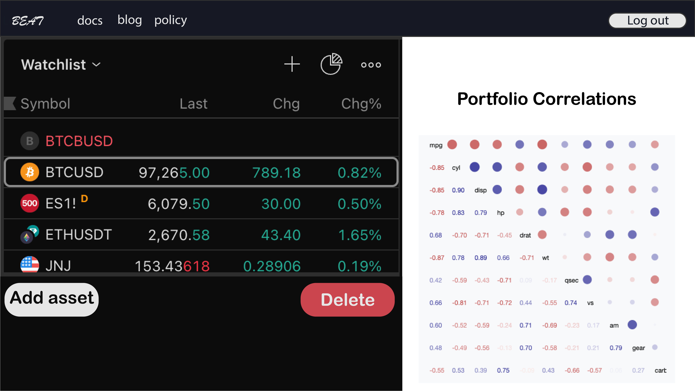
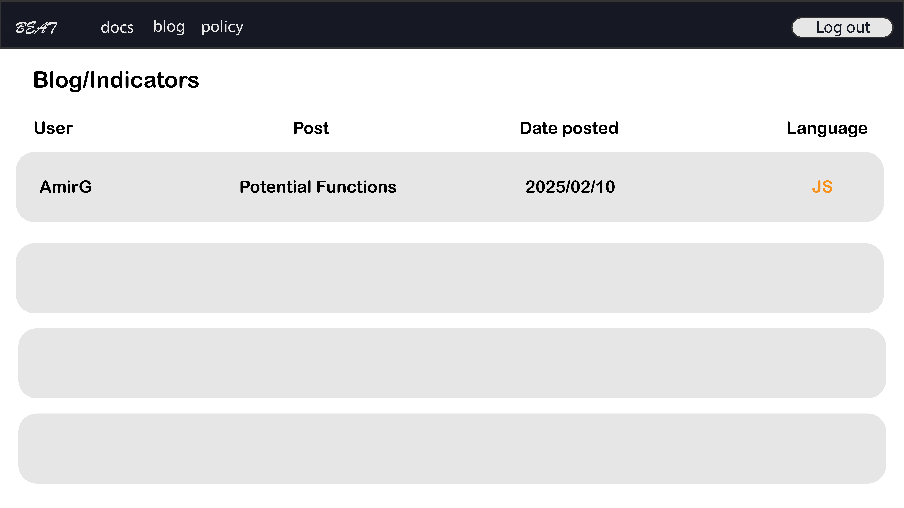
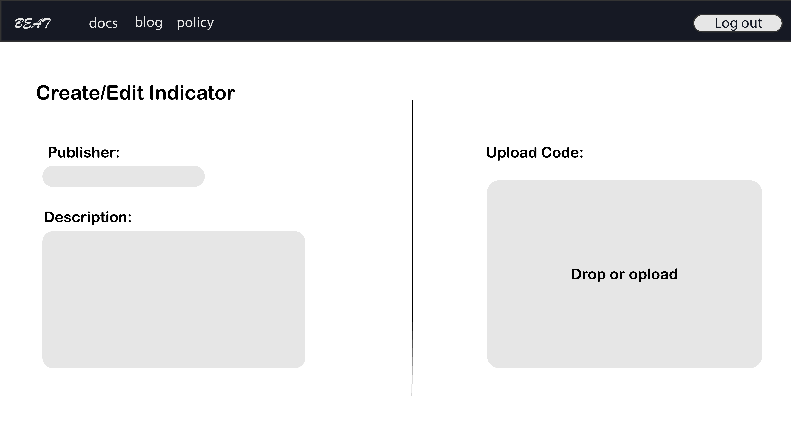
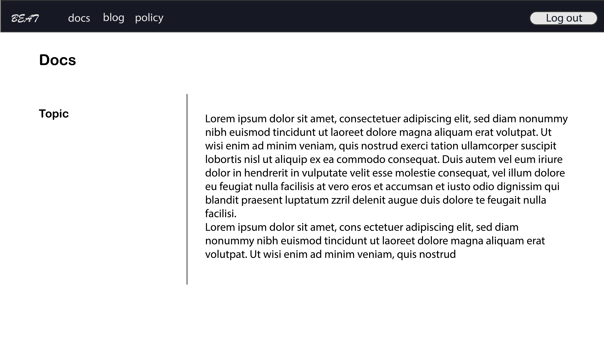
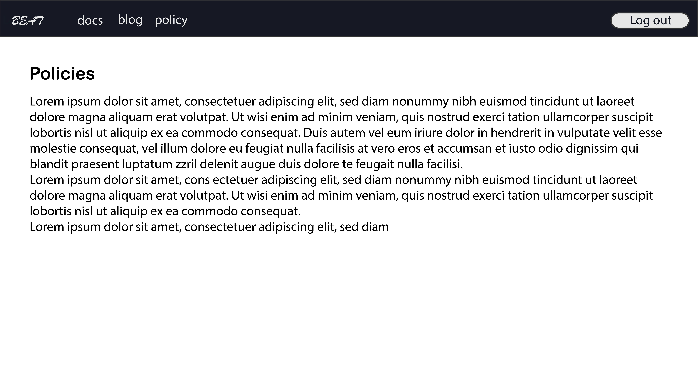

# Project Title

BEAT: AI-Powered Financial Monitoring Dashboard.

## Overview

BEAT is a website for Ecnophysicists and Financial Markets enthusiasts that provides various computational services to users.

### Problem

Econophysics is an interdisciplinary field between physics, computer science and finance. There are some helpful resources related to this subject such as [Econophysix](https://www.econophysix.com/). Other websites such as [Tradingview](https://www.tradingview.com/) provide computational services to traders and financial analysts. We plan to build a website that provides open source JS libraries for technical indicators and science based strategies. These libraries will provide the opportunity for JS programmers to build and test their trading strategies in real time. Considering that JS has a larger community than PineScript (Tradingview's scripting language), it will target a larger group of users. Other services of BEAT includes AI-powered anlytics on market news and user created strategies. This project is a tribute to the community of brilliant people who built and has been developing the field of Econophysics.

### User Profile

- Traders / Econophysicists:
  - looking for a JS based indicator or strategy.
  - looking for AI-based analysis of a certain asset or portfolio.
  - build, test, and publish their indicators and strategies.

### Features

- As a user, I want to be able to find web friendly indicators that I can use in my analysis.
- As a user, I want to be able to find the resources / links related to the field of Econophysics.
- As a user, I want to be able to share ideas, indicators, strategies, and published articles.

- As a user, I want to be able to create an account to manage my dashboard.
- As a user, I want to be able to login to my account to manage my dashboard.

- As a logged in user, I want to be able to watch and analyse real-time financial charts.
- As a logged in user, I want to be able to create / update my indicators.
- As a logged in user, I want to be able to see portfolios.
- As a logged in user, I want to be able to see other scientists works.

## Implementation

### Tech Stack

- React
- TypeScript
- MySQL
- Express
- Client libraries:
  - react
  - react-router
  - axios
- Server libraries:
  - knex
  - express
  - bcrypt for password hashing

### APIs

- Tradingview Chart API
- A news API **(not decided yet!)**
- Websocket for real time data flow (Binance)
- Hystorical data API (Binance)

### Sitemap

- Home page
- Blog/Indicators
- Portfolio
- Register
- Login
- Policies
- Chart + News
- Docs
- Create indicators
- Edit indicators

### Mockups

#### Register

#### Login

#### Home page

#### Portfolio

#### Blog

#### Create/Edit Blog

#### Docs

#### Policies

### Endpoints

**POST /users/register**

- Add a user account

Parameters:

- email: User's email
- password: User's provided password

**POST /users/login**

- Login a user

**GET /users/:userId**

- For authenticating user and fetching user data

**GET /POST/PUT/DELETE blogs/:blogId**

- CRUD operations on a single blog

**GET /blogs**

- Fetch all blogs

**GET hystoricalData/:symbol/:Startdate/:endDate/:timeFrame**

- Get the hystorical data for a symbol in a specified time window and for a chosen time frame (this might not be needed if we need an external API)

### Auth

- Passport

## Roadmap

- Create client

  - react project with routes and boilerplate pages

- Create server

  - express project with routing, with placeholder 200 responses

- Create migrations

- Upload 10 blog posts with description and the file the indicator

- Create seeds with sample data and files

- Deploy client and server projects so all commits will be reflected in production

- Feature: Connect to Binance websocket

  - Connect to Binance websocket and fetch real time data

- Feature: View chart

  - Connect the data flow to tradingview chart component

- Featture: News

  - Connect to a news API about a specific symbol
  - Use OpenAI API for sentiment anaysis on the news

Featture: Portfolio

- User must be able to add/delete assets to their portfolio
- A corelation matrix will exsit for the present portfolio

- Feature: Create/Edit page of indicators

  - POST the indicator and location of it's file to the DB

- Feature: List indicators

  - List all the blog posts / indicators

- Feature: Login

  - Implement login page + form
  - Create POST /users/login endpoint

- Bug fixes

- DEMO DAY

## Nice-to-haves

- Feature: Implement authentication using Passposrt
- Feature: A space that user can code and save a JS script
- Feature: User should be able to save and use their own indicators on the chart
- Feature: User should be able to create and backtest their trading strategies based on indicators
